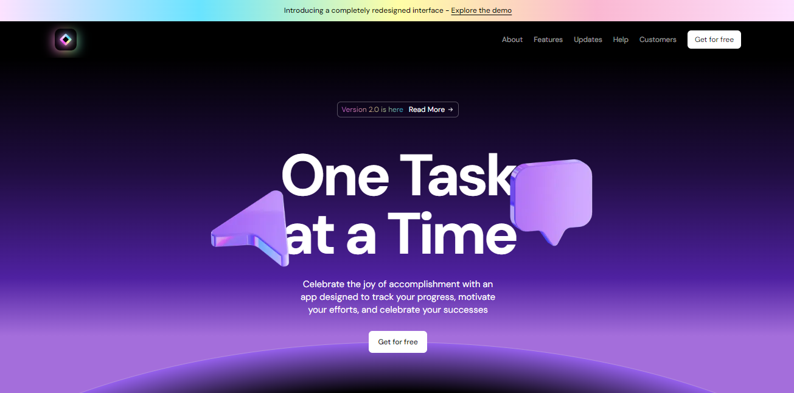
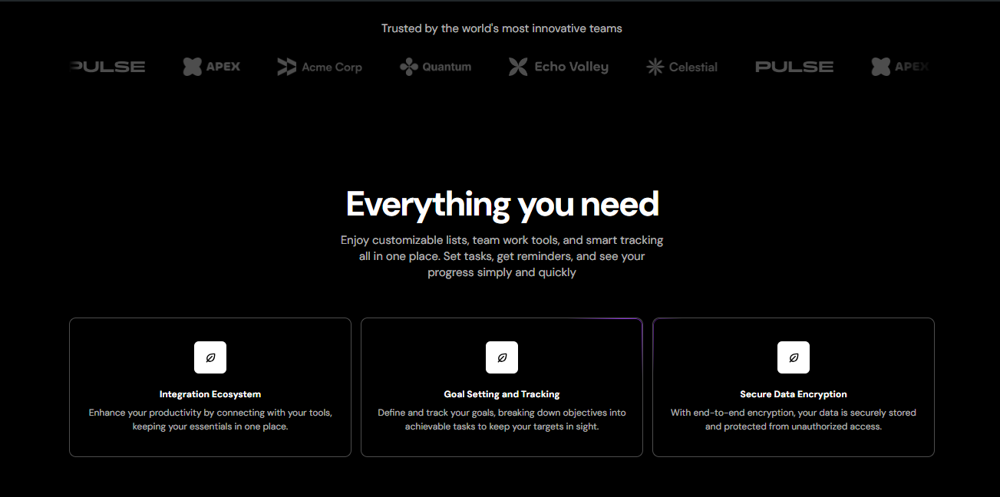
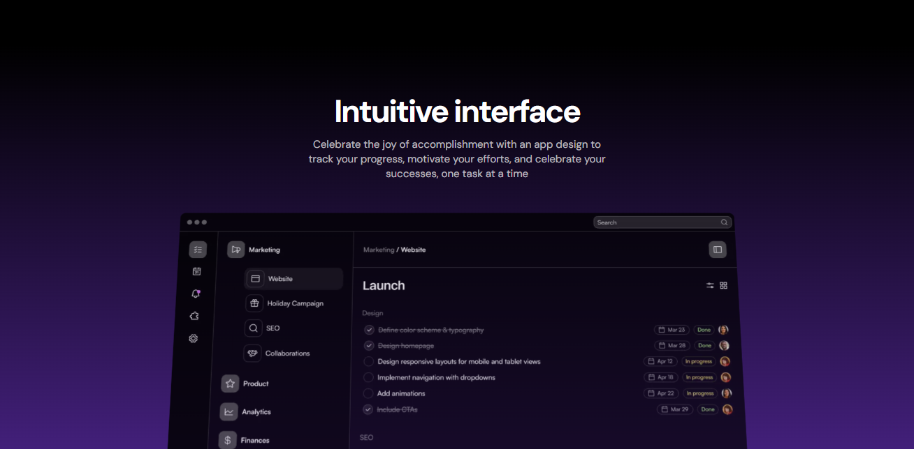
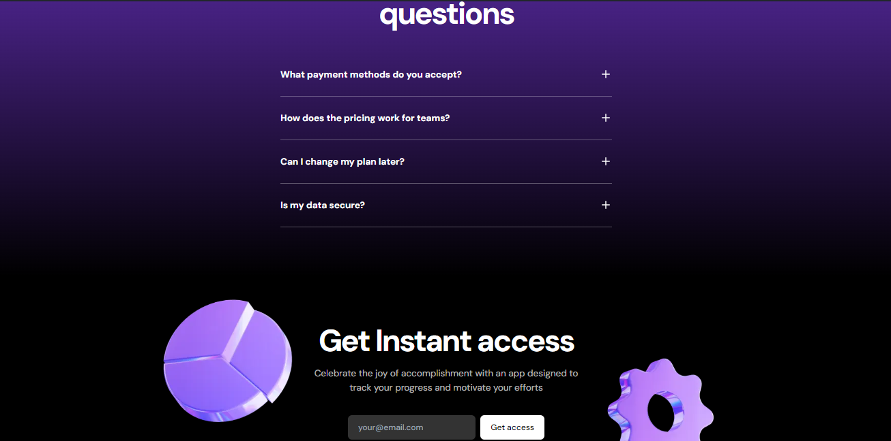

# About the App 

This is a SaaS Landing Page with Dark Mode built by Diego Tech by using:

- Next.js
- TypeScript

<br />






<br />

## I used the Libraries 🚀

- CLSX
- Framer Motion
- TailwindCSS

#

### One Message for EveryOne 🔥

> [!TIP]
> ```shell
> Aguante Argentina!!!
> Aguante Messi!!!
> ```